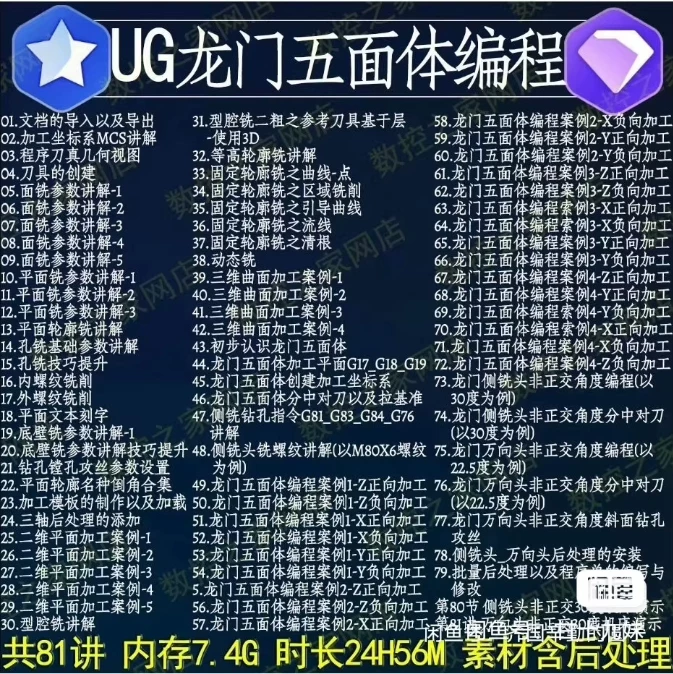
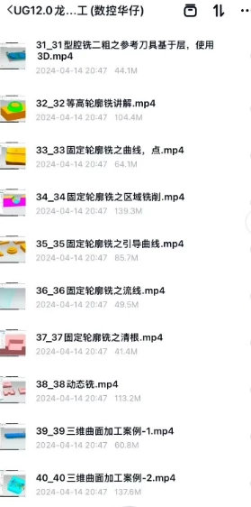
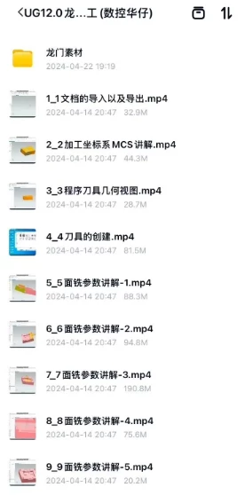
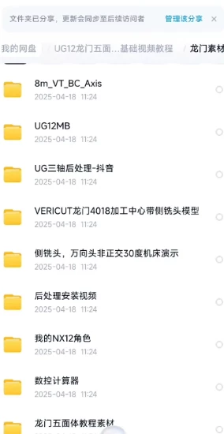
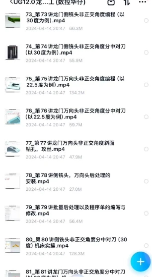
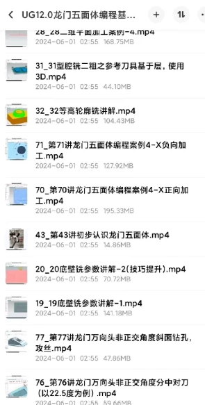

# UG G-code programming tutorial for the CNC machine tool with a gantry, complete content and materials.

## Body

UG Ganglun Five-Sided Solid Numerical Control Programming Tutorial, with comprehensive content and materials.
UG Ganglun Five-Sided Solid Numerical Control Programming Tutorial, with comprehensive content and materials.
UG Ganglun Five-Sided Solid Numerical Control Programming Tutorial, with comprehensive content and materials.

UG Ganglun Five-Sided Solid Numerical Control Programming Tutorial, with comprehensive content and materials.
It is progressively easy to learn, from basics to advanced levels.
A corresponding post-processing and built-in Ganglun VT model are also included.

Virtual goods, copyability. Once shipped, refunds are not allowed under any circumstances. Please make sure to purchase carefully before placing an order and understand that there will be no returns. Thank you for your understanding.

## Images

## Payment

Here is a pay link on Stripe ( https://buy.stripe.com/3cs8yP7sY87d0vu9AB ). Please contact me lonlonago@foxmail.com after funding $89, and I will send you a complete data files , thank you!

